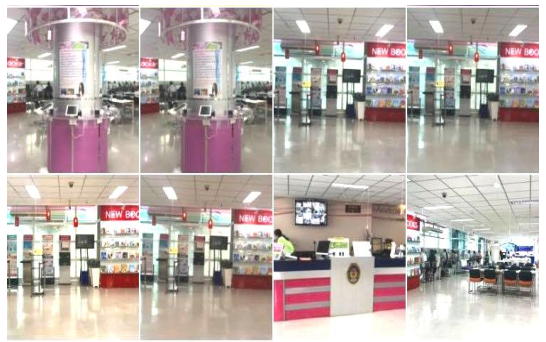
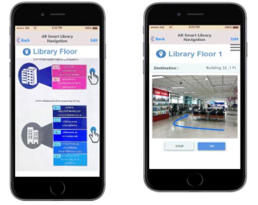
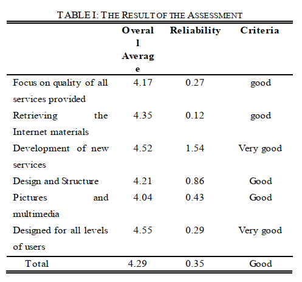

# PAPER REVIEW

<b>Title</b> : Implementing Virtual 3D Model and Augmented Reality Navigation for Library in University

<b>Author</b> : P. Jomsri

<b>Publication</b> : International Journal of Modeling and Optimization

<b>Year</b> : 2018

<b>Vol / No</b> : 8 / 6

# PAPER STRUCTURE
* Introduction
* Related Work
* Framework of Virtual 3D Model and Augmented Reality Navigation for Library in University
    * Study and Gathering Data
    * Designing 3D Model and Augmented Reality
Technology for the Library
    * System Development
    * System Testing and Implementation
* Result and Discussion
* Conclusion
* Acknowledgment
* Reference

# PAPER REVIEW

## PROBLEM
The problem of this study is library visitors consume long time to finding what they want especially for hardcopy book.

## PURPOSE
The purpose of this research is to improve the efficiency in terms of finding books in the library.

## METHOD
### Study and Gathering Data
Data is obtained by collecting important information in the library such as library’s services, bookshelf management, type of work required by the library, and related document and researches.

### Desiging 3D Model and Augmented Reality Technology for the Library
The process is divided into two parts:

#### System designing by drafting 3D virtual library system
1. Augmented Reality system designing for Indoor navigation by using Unity and Vuforia SDK.
2. Taking pictures in the building, adjusting regarding the requirement, and uploaded to Vuforia website.

3. Develop an in-building navigation system that determines the user's current location by pointing the camera to the marker point in the area. When the user determines the desired destination, the system calculates the shortest part with the Dijkstra Shortest Path Algorithm and displays the arrow on the image taken from the camera.
4. Design a map structure using the basic information needed, which is an important location in each floor. In the development process, there are several nodes that are used, namely turn node or intersection, signpost node, and book node.

#### Mobile application design
This step was to design the database system and design a mobile screen which linked to 3D model and Augmented Reality by designing the user interface and the functionality of each part.

### System Development
* 3D library by using Google Sketchup program
* Developing library navigation application using C#
* Vuforia SDK plugin was used to help identify the markers that appear in the camera
* Unity 3D engine to create realistic arrow images

### System Testing and Implementation
User satisfaction is obtained by distributing questionnaires to 50 system experts including students and other people to volunteer in assessment.

## RESULT AND DISCUSSION

## CONCLUSION
The application that has been developed can reduce the time spent searching books from the library. Providing users with an overview of library and navigation areas within the library, AR technology can display the user's location and direction of movement when the user navigated.

## ONGOING PROJECT
Create indoor navigation for university buildings to make it easier for new students to look for classes / laboratories.
